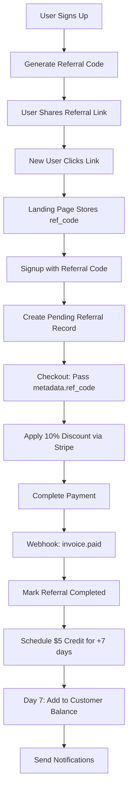

# LivePrompt.ai Referral Rewards System V2 - Dev-Ready

## Overview

The LivePrompt.ai referral system is a 2-sided rewards program designed to incentivize user growth through word-of-mouth marketing. Both parties benefit: referrers earn credits for successful referrals, and referred users receive a discount on their subscription.

## Key Features

- **$5 USD reward** for the referrer for each successful referral
- **10% discount** for the referred user on any subscription plan (monthly or yearly)
- **Unique referral codes** for every user (6-8 chars, uppercase)
- **Stripe Customer Balance** for credit management
- **Automated tracking** with fraud prevention
- **Real-time dashboard** for tracking referrals and credits
- **7-day delay** on credit grants for fraud prevention

## How It Works

### For Referrers (Existing Users)

1. **Get Your Referral Link**
   - Every user automatically receives a unique referral code upon signup
   - Referral URL format: `https://liveprompt.ai/?ref=<CODE>`
   - Access from Dashboard > Referrals section
   - Share via Web Share API, social media, or copy link/code

2. **Track Your Referrals**
   - Real-time dashboard showing:
     - Total referrals sent
     - Pending referrals (signed up but not paid)
     - Successful referrals (completed first payment)
     - Total credits earned
     - Credit redemption history

3. **Earn Rewards**
   - Receive $5 credit when referee completes first payment
   - 7-day delay before credit is available (fraud prevention)
   - Credits added to Stripe Customer Balance
   - Email notification upon earning credits

4. **Redeem Credits**
   - Credits automatically applied during checkout
   - Can combine multiple credits
   - Unused credits remain in account for future use
   - Credits expire after 12 months

### For Referees (New Users)

1. **Land with Referral**
   - Click referral link → `?ref=` param stored in localStorage
   - Cookie persists for 30 days (last-touch wins)
   - Code auto-populated during signup/checkout

2. **Get 10% Discount**
   - Automatic 10% discount at checkout
   - Works on both monthly and yearly plans
   - Special offer: 20% off for annual plans
   - Applied via Stripe Customer Balance or single-use coupon

3. **Complete First Payment**
   - Subscribe to any paid plan with discount
   - Referral marked as successful
   - Referrer receives their $5 reward (after 7 days)

## Technical Implementation

### Database Schema

```sql
-- Referral tracking with status enum
CREATE TYPE referral_status AS ENUM ('pending', 'completed', 'rewarded', 'expired');

CREATE TABLE user_referrals (
    id UUID PRIMARY KEY DEFAULT gen_random_uuid(),
    referrer_user_id UUID REFERENCES users(id),
    referee_user_id UUID REFERENCES users(id),
    referral_code VARCHAR(10),
    status referral_status DEFAULT 'pending',
    reward_amount DECIMAL(10,2) DEFAULT 5.00,
    referee_discount_percent INTEGER DEFAULT 10,
    referee_discount_applied BOOLEAN DEFAULT FALSE,
    device_id TEXT, -- FingerprintJS device ID
    ip_address INET,
    created_at TIMESTAMP DEFAULT NOW(),
    completed_at TIMESTAMP,
    rewarded_at TIMESTAMP,
    first_payment_id TEXT, -- Stripe payment ID
    stripe_coupon_id TEXT -- Stripe coupon ID for referee discount
);

-- Unique partial index: only one completed referral per user
CREATE UNIQUE INDEX uq_ref_completed 
ON user_referrals(referee_user_id) 
WHERE status = 'completed';

-- Optional: Separate referral codes table
CREATE TABLE referral_codes (
    id UUID PRIMARY KEY DEFAULT gen_random_uuid(),
    user_id UUID REFERENCES users(id),
    code VARCHAR(10) UNIQUE,
    is_active BOOLEAN DEFAULT TRUE,
    created_at TIMESTAMP DEFAULT NOW()
);

-- Credit system with Stripe integration
CREATE TABLE user_credits (
    id UUID PRIMARY KEY DEFAULT gen_random_uuid(),
    user_id UUID REFERENCES users(id),
    amount DECIMAL(10,2),
    type VARCHAR(50), -- referral_reward, promotional, manual_adjustment, redemption
    description TEXT,
    reference_id UUID, -- Links to user_referrals.id for referral rewards
    expires_at TIMESTAMP,
    created_at TIMESTAMP DEFAULT NOW(),
    stripe_customer_balance_txn_id TEXT -- Stripe Customer Balance transaction ID
);

-- Index for expiry lookups
CREATE INDEX idx_credit_expiry 
ON user_credits(expires_at) 
WHERE expires_at IS NOT NULL;

-- Update users table
ALTER TABLE users ADD COLUMN referral_code VARCHAR(10) UNIQUE;
ALTER TABLE users ADD COLUMN referred_by_user_id UUID REFERENCES users(id);
CREATE INDEX idx_users_referral_code ON users(referral_code);
```

### Referral Code Generation

- **Format**: 6-8 alphanumeric characters, uppercase (e.g., "LIVE2024", "PROMPT5X")
- **Algorithm**: User initials + random alphanumeric
- **Collision handling**: Regenerate if duplicate
- **Storage**: Uppercase only, accept any case on input

### Landing Page Capture

```javascript
// Landing page script
const urlParams = new URLSearchParams(window.location.search);
const refCode = urlParams.get('ref');
if (refCode) {
    localStorage.setItem('ref_code', refCode.toUpperCase());
    localStorage.setItem('ref_timestamp', Date.now());
    // Track event
    analytics.track('referral_link_clicked', { code: refCode });
}

// Expire after 30 days
const stored = localStorage.getItem('ref_timestamp');
if (stored && Date.now() - stored > 30 * 24 * 60 * 60 * 1000) {
    localStorage.removeItem('ref_code');
    localStorage.removeItem('ref_timestamp');
}
```

### Referral Flow with Stripe



## Business Rules

### Referral Eligibility

1. **Referrer Requirements**
   - Must have active account
   - No limit on number of referrals (rate limited to 5/day)
   - Can refer users even on free plan

2. **Referee Requirements**
   - Must be new user (no existing account)
   - Must use referral link/code during signup
   - Cannot use their own referral code
   - Automatically receives discount based on plan choice

3. **Reward Conditions**
   - Referee must complete first payment
   - 7-day delay before credit is available
   - Minimum payment amount: $10 (after discount)
   - Credits distributed via Stripe Customer Balance

### Variable Rewards (Optional Enhancement)

- **Base**: $5 flat rate
- **Alternative**: 20% of first invoice (min $5, cap $15)
- **Annual bonus**: Referees get 20% off yearly plans (instead of 10%)

### Anti-Fraud Measures

1. **Device Fingerprinting**
   - FingerprintJS integration
   - Store device_id on signup and payment
   - Flag if device_id + card creates >3 accounts

2. **Rate Limiting**
   - Max 5 referrals per day per IP AND device_id
   - Temporary email addresses blocked
   - Same payment method limit: 3 accounts

3. **Credit Delays**
   - 7-day hold on all referral credits
   - Manual review for high-value redemptions
   - Auto-flag suspicious patterns

## User Interface

### Dashboard Referral Widget

```
┌─────────────────────────────────────┐
│ 🎉 Referral Rewards                 │
├─────────────────────────────────────┤
│ Your Referral Code: LIVE2024        │
│ [Copy Link] [Copy Code] [Share]     │
├─────────────────────────────────────┤
│ Total Referrals: 12                 │
│ Pending: 3                          │
│ Credits Earned: $60                 │
│ Available Balance: $35              │
├─────────────────────────────────────┤
│ ⚠️ $10 expiring in 14 days         │
│ [View All Referrals →]              │
└─────────────────────────────────────┘
```

### Shareability Features

- **Web Share API** for native mobile sharing
- **Copy as Image** - generates branded PNG with QR code
- **Pre-generated UTM params**: `utm_source=referral&utm_medium=share`
- **Social media templates** with pre-filled text

### Checkout Integration

**For Referees (Getting Discount):**
```
┌─────────────────────────────────────┐
│ Order Summary                       │
├─────────────────────────────────────┤
│ Pro Plan (Monthly)         $29.99   │
│ Referral Discount (10%)   -$3.00   │
│ ─────────────────────────────────── │
│ Subtotal                   $26.99   │
│                                     │
│ 🎉 Referred by John D.              │
│ You saved $3.00!                    │
│                                     │
│ Have a different code? [Enter]      │
│ ─────────────────────────────────── │
│ Total Due                  $26.99   │
└─────────────────────────────────────┘
```

## Analytics Events

| Event Name | Trigger | Properties |
|------------|---------|------------|
| `referral_link_clicked` | `?ref=` param detected | `code`, `source` |
| `referral_signup` | Account created with ref_code | `code`, `referrer_id` |
| `referral_paid` | First invoice paid | `amount`, `plan`, `discount` |
| `referral_credit_granted` | $5 credit issued | `referrer_id`, `amount` |
| `credit_redeemed` | Credits applied in checkout | `amount`, `remaining_balance` |

### Conversion Funnel
1. Link clicked → 2. Signed up → 3. Paid → 4. 90-day retained

## API Endpoints

### Referral Management

```typescript
// Get user's referral info
GET /api/referrals/me
Response: {
  referral_code: string,
  referral_url: string, // Full URL with ?ref=CODE
  stats: {
    total_referrals: number,
    pending: number,
    completed: number,
    total_earned: number,
    credit_balance: number
  }
}

// Get referral history
GET /api/referrals/history
Response: {
  referrals: [{
    id: string,
    referee_email: string, // Partially hidden
    status: 'pending' | 'completed' | 'rewarded' | 'expired',
    created_at: string,
    completed_at: string,
    reward_amount: number
  }]
}

// Validate referral code
POST /api/referrals/validate
Body: { code: string }
Response: { 
  valid: boolean, 
  referrer_name: string,
  discount_percent: number // 10 or 20 for annual
}
```

### Stripe Integration

```typescript
// Create checkout session with referral
POST /api/checkout/create
Body: { 
  plan_id: string,
  ref_code?: string // From localStorage or manual entry
}
Response: {
  checkout_url: string,
  // Backend applies discount via metadata
}

// Webhook handler
POST /api/webhooks/stripe
// invoice.paid event:
// 1. Find referral by stripe metadata
// 2. Mark completed
// 3. Schedule credit for +7 days
```

## Email Notifications

### For Referrers

1. **Referral Signup** (Instant)
   - Subject: "Someone just used your referral link!"
   - Content: Name signed up, pending payment

2. **Credit Earned** (Day 7)
   - Subject: "You've earned $5 in referral credits!"
   - Content: Credits available, current balance

3. **Credit Expiring** (14 days before)
   - Subject: "Your $X credits expire soon"
   - Content: Amount, expiry date, use now CTA

### For Referees

1. **Welcome Email**
   - Subject: "Welcome! You saved $X with [Referrer]'s invite"
   - Content: Discount applied, referrer credited

## Implementation Sequence

1. **Week 1: Database & Backend**
   - Schema migrations with enum types
   - Referral code generation
   - Basic API endpoints

2. **Week 2: Stripe Integration**
   - Customer Balance setup
   - Checkout discount application
   - Webhook handlers with 7-day delay

3. **Week 3: Frontend Core**
   - Landing page capture script
   - Signup/checkout integration
   - Basic referral dashboard

4. **Week 4: Fraud & Polish**
   - FingerprintJS integration
   - Rate limiting
   - Email notifications

5. **Week 5: Enhancements**
   - Web Share API
   - Image generation
   - Analytics events

6. **Week 6-8: Testing & Rollout**
   - QA on staging
   - 10% traffic flag
   - Monitor metrics
   - Full rollout

## Security Considerations

1. **Data Protection**
   - Hash device fingerprints
   - Encrypt PII in referral records
   - Rate limit all endpoints

2. **Fraud Prevention**
   - 7-day credit delay
   - Device + IP tracking
   - Manual review triggers

3. **Audit Trail**
   - Log all referral events
   - Track credit transactions
   - Monitor conversion anomalies

## Success Metrics

### KPIs to Track

1. **Program Health**
   - Referral participation rate (target: 15%)
   - Referral → Paid conversion (target: 25%)
   - Credits → Revenue conversion (target: 60%)

2. **Financial Impact**
   - CAC via referrals vs paid channels
   - LTV of referred vs organic users
   - Program ROI (revenue - (credits + discounts))

3. **Fraud Metrics**
   - False positive rate on fraud flags
   - Credit reversals needed
   - Multi-account detection rate

## FAQs

1. **How do I get my referral link?**
   - Dashboard > Referrals, or API `/api/referrals/me`

2. **Why is there a 7-day delay for credits?**
   - Fraud prevention and refund window

3. **Do referral codes expire?**
   - No, but credits expire after 12 months

4. **Can I stack referral discount with other promos?**
   - No, referral discount only

5. **What if someone uses multiple referral codes?**
   - Last code entered wins (last-touch attribution)

## Micro-Optimizations

- **Badge System**: Unlock "$3 bonus" for 3 referrals in 7 days
- **Yearly Push**: Auto-upgrade discount to 20% if annual plan selected
- **Re-engagement**: "Your friend just saved $X" notifications
- **Leaderboard**: Top referrers of the month (optional gamification)